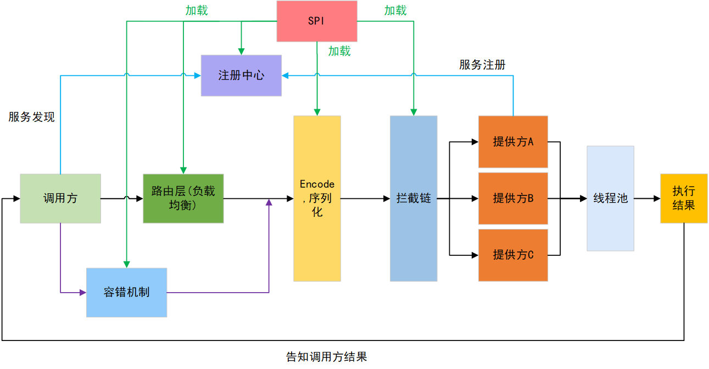

# min-RPC

基于Java SPI机制构建高度模块化的可插拔RPC框架，RPC的架构由注册中心、代理层、路由层、容错层、协议层、拦截器层、业务线程池组成，支持各层级组件热插拔与灵活扩展。


# &#x1F680;快速部署

✅克隆本项目

```
git clone https://github.com/fuming-wang/min-RPC.git
```

✅安装接口模块

```
cd interface
mvn install
```

✅安装RPC模块

```
cd wfm-Rpc
mvn install
```

✅启动Provider和Consumer模块进行测试

🚩关于配置参数

```xml
# Netty端口
rpc.port=5555
# 注册中心实现 [redis | zookeeper]
rpc.register-type=redis
# 注册中心的IP:port
rpc.register-addr=172.31.160.189:6379
# 序列化方式 [json | hessian]
rpc.serialization=hessian
# 用于拦截器链的配置，当前实现了token拦截，这是服务端
rpc.service.token=123456
# 这是测试端
rpc.client.token=123456
```


# 结构




